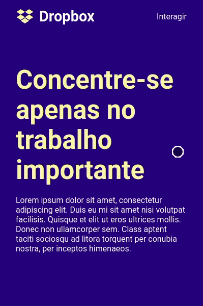

<h1 align="center">
  Dropbox Menu Clone
</h1>
<p align="center">
  Responsive Dropbox Menu interface recreated with ReactJS and Styled Components.
</p>
<div align="center">
  
</div>

<br>

<h2>
  Getting Started
</h2>

Instale as dependências do projeto com o gerenciador de pacotes que estiver utilizando:

```bash
npm install
# ou
yarn
```

Execute o servidor de desenvolvimento:

```bash
npm start
# ou
yarn start
```

A página estará disponível em [http://localhost:3000](http://localhost:3000), basta acessar pelo navegador.